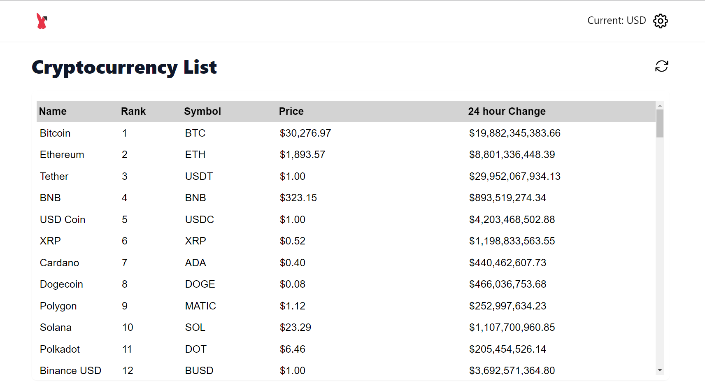
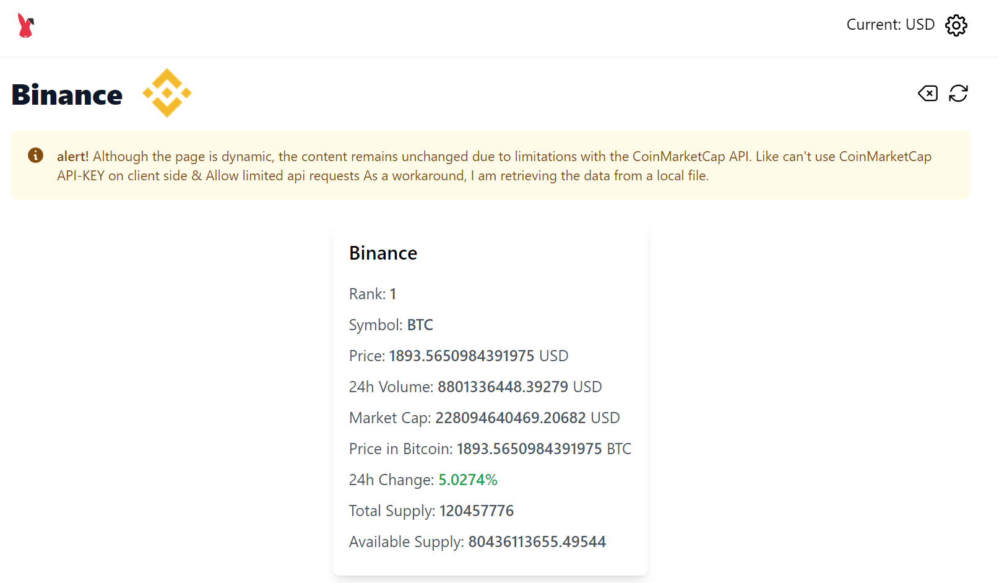

# Cryptocurrency Reactjs Assignment

## site Deployed at: https://6439374a75ba410089f1a7d6--leafy-begonia-0dddcc.netlify.app/

ReactJS application for Food App (styled-components + react-spring + @react-google-maps/api + vite).

 

 
 

 

### Mockups

  

 
